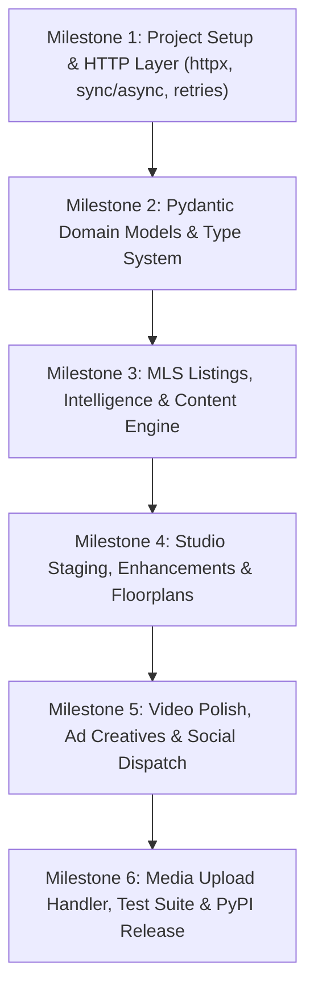

# mlsapi.dev Python SDK Specification

> **Official Python client library specification for `mlsapi.dev` — Real estate MLS listing ingestion, property intelligence, automated marketing copy, and Studio generative visual AI.**

---

## 1. Executive Summary & Vision

The `mlsapi` Python SDK provides Python developers, data scientists, PropTech engineering teams, and real estate automated platforms with a fully-typed, idiomatic, high-performance client library for interacting with the `mlsapi.dev` platform.

Mirrored against the TypeScript SDK and the core Hono backend engine, the Python SDK bridges two foundational domains into a unified Pythonic interface:

1. **MLS Data & Property Intelligence Engine:**
   - Sub-50ms normalized MLS listing lookup with automatic on-demand ingestion.
   - In-depth property intelligence: CapEx replacement horizons (roof, HVAC, water heater, impact windows), historical tax resets, and investor-grade financial metrics (gross rental yields, rent ranges).
   - Context-aware marketing copy generation across Instagram, Facebook, LinkedIn, X/Twitter, TikTok, YouTube, and email blasts.

2. **Studio Visual AI & Generative Media Engine:**
   - Virtual room staging across 29 interior design styles and 12 architectural room types.
   - Day-to-dusk twilight conversion and exterior enhancement (blue skies, green grass, pool cleaning, garden tidying).
   - Room decluttering, full room de-staging (emptying), and style restyling.
   - Precision furniture swapping and surface material replacement (countertops, flooring, cabinetry).
   - 3x3 wall paint color comparison swatch grids.
   - 2D blueprint structural analysis and 3D isometric dollhouse cutaway generation.
   - 4K super-resolution upscaling and CAD/sketch-to-photoreal architectural rendering.
   - Multi-placement branded ad creative generation with agent brand kits and Fair Housing compliance.
   - Video automation: walkthrough reels, realtor video polish (studio voice, Hormozi-style animated subtitles, auto-reframe), and before/after transition morphs.

---

## 2. Design Principles & Pythonic Idioms

* **Dual Sync & Async Clients:**
  First-class support for both synchronous and asynchronous workflows:
  - `MlsApiClient` (or `MLS`) for scripts, standard Django/Flask apps, Airflow tasks, and Celery workers.
  - `AsyncMlsApiClient` (or `AsyncMLS`) for FastAPI, Starlette, Tornado, and high-concurrency `asyncio` pipelines.
* **Modern HTTP Engine (`httpx`):**
  Built on `httpx` to provide robust HTTP/2 support, persistent connection pooling, seamless streaming, and identical sync/async client semantics.
* **Deep Type Safety & Pydantic v2 Models:**
  Complete PEP 484 / PEP 526 / PEP 585 type annotations. All request options, domain entities, and responses are modeled with Pydantic v2 `BaseModel` for validation, IDE autocompletion, and schema serialization.
* **Dual Execution Modes (Async Job vs. Auto-Wait):**
  Long-running AI jobs return an HTTP `202 Accepted` job tracker (`Job` or `StudioJob`). Every operation provides a companion `*_and_wait(...)` method (or `wait=True` parameter) featuring exponential backoff polling, customizable timeouts, and user progress hooks (`Callable[[JobProgress], None]`).
* **Context Manager Support:**
  Both clients implement standard context managers (`with MlsApiClient() as mls:` and `async with AsyncMlsApiClient() as mls:`) for clean session and connection pool lifecycle management.
* **Flexible File Uploads:**
  Media upload utilities accept filesystem paths (`str` or `pathlib.Path`), raw bytes (`bytes`), or binary file streams (`BinaryIO`).
* **Resilient by Default:**
  Automatic retries with exponential backoff and jitter on HTTP 429 (Rate Limits) and 5xx (Transient Server Errors).

---

## 3. Package Structure & Distribution

```text
sdks/python/
├── pyproject.toml               # PEP 621 / Hatchling build specification
├── README.md                    # Developer guide & full examples
├── SPEC.md                      # This specification document
├── src/
│   └── mlsapi/
│       ├── __init__.py          # Public exports (MlsApiClient, AsyncMlsApiClient, Enums, Models)
│       ├── client.py            # Synchronous MlsApiClient
│       ├── async_client.py      # Asynchronous AsyncMlsApiClient
│       ├── config.py            # Client configuration dataclass
│       ├── errors.py            # Typed exception hierarchy
│       ├── http.py              # Synchronous HTTP transport & retry wrapper
│       ├── async_http.py        # Asynchronous HTTP transport & retry wrapper
│       ├── poller.py            # Polling engine (sync & async backoff)
│       ├── models/
│       │   ├── __init__.py
│       │   ├── listings.py      # BaseListing, Address, Specifications, Features
│       │   ├── intelligence.py  # PropertyIntelligence, CapEx, InvestorInsights
│       │   ├── content.py       # ContentGenerationResponse, SocialPlatformBundle
│       │   ├── studio.py        # StudioJob, StagingResult, DollhouseResult, etc.
│       │   └── common.py        # Enums (InteriorStyle, RoomType, Platform, etc.)
│       └── resources/
│           ├── __init__.py
│           ├── listings.py      # ListingsResource & AsyncListingsResource
│           ├── intelligence.py  # IntelligenceResource & AsyncIntelligenceResource
│           ├── content.py       # ContentResource & AsyncContentResource
│           ├── studio/
│           │   ├── __init__.py
│           │   ├── staging.py   # Staging, declutter, empty, restyle, furniture, materials, paint
│           │   ├── enhance.py   # Exterior enhancement & 4K upscaling
│           │   ├── floorplan.py # Blueprint analysis & 3D dollhouse rendering
│           │   ├── render.py    # Architectural CAD / sketch renders
│           │   ├── creatives.py # Ad creatives & brand kits
│           │   ├── social.py    # Social network publishing
│           │   ├── video.py     # Video enhance, reels, walkthroughs, transitions
│           │   ├── upload.py    # Media CDN upload handler
│           │   └── jobs.py      # Studio job status tracking & polling
│           └── account/
│               ├── __init__.py
│               ├── billing.py   # Credit balances, subscription tiers
│               └── keys.py      # API key verification & grace rotation
└── tests/
    ├── conftest.py
    ├── test_client.py
    ├── test_listings.py
    ├── test_studio.py
    └── test_poller.py
```

---

## 4. Client API Architecture

### 4.1 Client Initialization

#### Synchronous Client
```python
from pymlsapi import MlsApiClient

mls = MlsApiClient(
    api_key="sk_live_...",            # Or reads from MLSAPI_KEY environment variable
    environment="live",              # "live" | "test"
    base_url="https://mlsapi.dev",    # Optional custom base URL
    timeout_seconds=60.0,             # Request timeout in seconds
    max_retries=3,                    # Retries on 429/5xx errors
)
```

#### Asynchronous Client
```python
from pymlsapi import AsyncMlsApiClient

async with AsyncMlsApiClient(api_key="sk_live_...") as mls:
    listing = await mls.listings.get_and_wait("A12079565")
```

### 4.2 Resource Namespace Hierarchy

```text
mls
├── listings
│   ├── get(mls_id) -> BaseListing | IngestJob
│   ├── get_and_wait(mls_id, ...) -> BaseListing
│   ├── enqueue(mls_id, ...) -> IngestJob
│   ├── get_job(job_id) -> IngestJob
│   └── list_jobs(limit=20) -> list[IngestJob]
│
├── intelligence
│   └── get(mls_id, include_llm=True, investor_mode=False) -> PropertyIntelligence
│
├── content
│   └── generate(mls_id, outputs=[...], tone="luxury", ...) -> ContentGenerationResponse
│
├── studio
│   ├── staging
│   │   ├── stage(photo_url, ...) / stage_and_wait(...) -> StagingResult
│   │   ├── declutter(photo_url, ...) / declutter_and_wait(...) -> DeclutterResult
│   │   ├── empty(photo_url, ...) / empty_and_wait(...) -> DeStageEmptyResult
│   │   ├── restyle(photo_url, ...) / restyle_and_wait(...) -> RestyleResult
│   │   ├── replace_furniture(...) / replace_furniture_and_wait(...) -> ReplaceFurnitureResult
│   │   ├── replace_material(...) / replace_material_and_wait(...) -> ReplaceMaterialResult
│   │   ├── wall_colors(photo_url, ...) / wall_colors_and_wait(...) -> WallColorsResult
│   │   └── twilight(photo_url, ...) / twilight_and_wait(...) -> TwilightResult
│   │
│   ├── enhance
│   │   ├── exterior(photo_url, ...) / exterior_and_wait(...) -> ExteriorEnhanceResult
│   │   └── upscale(image_url, ...) / upscale_and_wait(...) -> UpscaleResult
│   │
│   ├── floorplan
│   │   ├── analyze(floorplan_image_url, ...) -> FloorPlanAnalysisResponse
│   │   └── render_3d(floorplan_image_url, ...) / render_3d_and_wait(...) -> Render3dResult
│   │
│   ├── render
│   │   └── architectural(source_image_url, ...) / architectural_and_wait(...) -> ArchitecturalRenderResult
│   │
│   ├── creatives
│   │   └── generate(mls_id, ...) / generate_and_wait(...) -> AdCreativesResult
│   │
│   ├── social
│   │   └── publish(asset_url, destinations=[...], ...) -> SocialPublishResult
│   │
│   ├── video
│   │   ├── enhance(video_url, ...) / enhance_and_wait(...) -> VideoEnhanceResult
│   │   ├── walkthrough(...) / walkthrough_and_wait(...) -> VideoWalkthroughResult
│   │   ├── transition(start_image_url, end_image_url, ...) / transition_and_wait(...) -> VideoTransitionResult
│   │   └── tour(ordered_photos, ...) / tour_and_wait(...) -> HouseTourResult
│   │
│   ├── custom(prompt, ...) / custom_and_wait(...) -> CustomStudioResult
│   │
│   ├── upload(file, filename=None, content_type=None) -> UploadResult
│   │
│   └── jobs
│       ├── get(job_id) -> StudioJob
│       └── wait_for(job_id, timeout_seconds=90.0, poll_interval=2.0) -> StudioJob
│
└── account
    ├── get_billing_overview() -> BillingOverview
    └── verify_key() -> ApiKeyInfo
```

---

## 5. Domain Modules & Detailed Specifications

### 5.1 Listings & Ingestion (`mls.listings`)

Handles MLS identifier resolution, on-demand scraping, and normalized property models.

* `get(mls_id: str) -> Union[BaseListing, IngestJob]`:
  If cached or immediately available, returns `BaseListing`. If ingestion is triggered or in progress, returns HTTP 202 `IngestJob`.
* `get_and_wait(mls_id: str, timeout_seconds: float = 60.0, poll_interval: float = 2.0, on_progress: Optional[Callable[[IngestJob], None]] = None) -> BaseListing`:
  Polls until background scraping and photo ingestion complete, returning the fully normalized `BaseListing`.
* `enqueue(mls_id: str, download_photos: bool = True, upload_to_r2: bool = True, photos_concurrency: int = 5) -> IngestJob`:
  Explicitly schedules deep property scraping and asset downloading.
* `get_job(job_id: str) -> IngestJob`:
  Returns live ingestion status, current processing step, and photo download counter.

### 5.2 Property Intelligence (`mls.intelligence`)

Synthesizes county public tax records, transfer deeds, school zoning, and LLM-driven structural CapEx lifespan analysis.

* `get(mls_id: str, include_llm: bool = True, investor_mode: bool = False) -> PropertyIntelligence`:
  - `include_llm`: Evaluates remarks to detect age, condition, and estimated replacement horizon for roof, HVAC, water heater, and hurricane impact windows.
  - `investor_mode`: Calculates estimated gross rental yields, monthly rent ranges, and HOA rental restrictions.

### 5.3 Context-Aware Content Generation (`mls.content`)

Generates multi-platform marketing copy from property facts or manual overrides.

* `generate(mls_id: str, outputs: list[str], tone: str = "luxury", social_platforms: Optional[list[str]] = None, target_audience: Optional[str] = None, property_details: Optional[dict] = None) -> ContentGenerationResponse`:
  - Outputs supported: `"social"`, `"email_blast"`, `"video_script"`, `"flyer_bullets"`, `"mls_remarks"`, `"investor_pitch"`.
  - Platforms: `"instagram"`, `"facebook"`, `"linkedin"`, `"x_twitter"`, `"tiktok"`, `"youtube"`.

### 5.4 Studio Visual AI (`mls.studio`)

Interacts with `/v1/studio/*` generative endpoints.

#### Staging & Interiors (`mls.studio.staging`)
- `stage` / `stage_and_wait`: Inpaints photorealistic furniture into vacant rooms across 29 curated architectural styles.
- `declutter` / `declutter_and_wait`: Removes clutter, trash, wires, and boxes while preserving walls and architecture.
- `empty` / `empty_and_wait`: Strips all furnishings down to the bare room with optional floor restoration (`hardwood`, `tile`, `carpet`, `polished_concrete`).
- `restyle` / `restyle_and_wait`: Restyles an already furnished room into a new aesthetic (e.g. Traditional to Scandinavian).
- `replace_furniture` / `replace_furniture_and_wait`: Precision item swap targeting a specific piece (e.g. sofa, bed) with optional product image reference.
- `replace_material` / `replace_material_and_wait`: Resurfaces countertops, backsplash, or flooring.
- `wall_colors` / `wall_colors_and_wait`: Generates a 3x3 visual comparison grid of curated designer wall paint swatches.
- `twilight` / `twilight_and_wait`: Converts daytime exterior shots into warm twilight scenes or replaces overcast skies.

#### Enhancements (`mls.studio.enhance`)
- `exterior` / `exterior_and_wait`: Applies blue sky replacement, green lawn touchups, pool cleaning, and garden tidying.
- `upscale` / `upscale_and_wait`: 4K super-resolution upscaling (2x or 4x factor) with detail enhancement.

#### Floorplans & 3D Dollhouses (`mls.studio.floorplan`)
- `analyze`: Extracts room dimensions, geometry, and design specifications from 2D blueprints.
- `render_3d` / `render_3d_and_wait`: Generates photorealistic 3D cutaway isometric dollhouse models.

#### Video Automation (`mls.studio.video`)
- `enhance` / `enhance_and_wait`: Voice enhancement (-18dB noise/echo removal), Hormozi-style animated word subtitles, and 9:16 vertical re-framing.
- `walkthrough` / `walkthrough_and_wait`: Photo-to-video reel generation with AI voiceover and music.
- `transition` / `transition_and_wait`: Before/after renovation timelapse morph.
- `tour` / `tour_and_wait`: Multi-room cinematic walkthrough montage.

#### Branded Ad Creatives (`mls.studio.creatives`)
- `generate` / `generate_and_wait`: Generates multi-placement ad creative suites (Feed Portrait 4:5, Square 1:1, Story 9:16, Flyer 8.5x11) with agent brand kit and Fair Housing compliance checks.

---

## 6. Smart Polling & Asynchronous Architecture

Because AI image generation and video processing take between 5 to 30 seconds, the SDK provides resilient asynchronous polling logic for both sync and async runtimes:

```python
# Synchronous Polling
result = mls.studio.staging.stage_and_wait(
    photo_url="https://cdn.mlsapi.dev/uploads/vacant.jpg",
    room_type="living_room",
    style="modern",
    poll_interval=2.0,
    timeout_seconds=90.0,
    on_progress=lambda job: print(f"Progress: {job.progress_percentage}% - {job.current_step}")
)

# Asynchronous Polling
result = await mls.studio.staging.stage_and_wait(
    photo_url="https://cdn.mlsapi.dev/uploads/vacant.jpg",
    room_type="living_room",
    style="modern",
    poll_interval=2.0,
    timeout_seconds=90.0,
    on_progress=lambda job: print(f"Async Progress: {job.progress_percentage}%")
)
```

### Poller Design:
- Exponential backoff with jitter (initial interval: 1.5s, max interval: 5.0s, backoff multiplier: 1.25).
- Clean cancellation and timeout enforcement with `JobTimeoutError`.
- Detailed failure diagnostics extracting worker error logs via `StudioJobFailedError`.

---

## 7. Error Hierarchy & Exception Model

All SDK exceptions inherit from `MlsApiError`, exposing status code, error code, and server payload:

```text
MlsApiError (Base exception)
├── AuthenticationError (401 - Invalid or missing API key)
├── PermissionDeniedError (403 - Tier restriction or inactive account)
├── NotFoundError (404 - Property or job ID not found)
├── InvalidRequestError (400 - Validation failure or missing parameters)
├── RateLimitError (429 - Quota or concurrency limit exceeded)
├── InsufficientCreditsError (402 - Insufficient workspace balance)
├── StudioJobFailedError (Job processed by AI engine but returned failure status)
└── JobTimeoutError (Wait operation exceeded timeout_seconds)
```

---

## 8. Implementation Roadmap



* **Milestone 1:** Package setup (`pyproject.toml`), `httpx` wrapper with sync/async transports, authentication headers, exponential backoff retries, and error hierarchy.
* **Milestone 2:** Pydantic v2 domain models for all MLS entities, CapEx reports, 29 interior styles, 12 room types, and studio parameters.
* **Milestone 3:** Implementation of `mls.listings`, `mls.intelligence`, and `mls.content` resources with sync and async interfaces.
* **Milestone 4:** Implementation of core Studio visual operations (`staging`, `declutter`, `empty`, `restyle`, `twilight`, `furniture`, `material`, `wall_colors`, `exterior`, `upscale`, `floorplan`).
* **Milestone 5:** Video polish, multi-room tour, ad creatives suite, and direct social publishing.
* **Milestone 6:** CDN media upload utility (supporting paths, bytes, streams), mock server test suite, CI/CD pipeline, and PyPI publishing.
